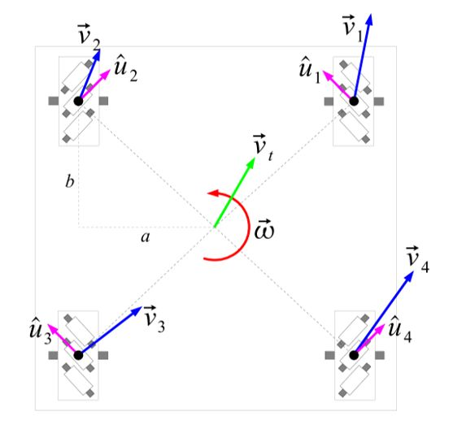

# RM2022 - Cypher


## reference
* [2022RM校内赛规则](./2022RM校内赛规则V1.1)
* [第一次宣讲视频](https://www.bilibili.com/video/BV1JL411s76t?spm_id_from=333.999.0.0)
* [底盘运动拆解分析](https://zhuanlan.zhihu.com/p/20282234)

## working log
* 2021/10/2		创建 git 仓库，下载并查看校内赛规则
* 2021/10/10	看完校内赛第一次宣讲视频
* 2021/10/11	配置电控环境
* 2021/10/13	学创碰头，编译成功校赛官方代码
* 2021/10/16	参加学创电控第一次培训

## task
### 底盘运动控制
* 4 个麦轮(45 度角) + 4 个 3508 电机
* 参考[这篇文章](https://zhuanlan.zhihu.com/p/20282234)
$$
\vec{v} = \vec{v_t} + \vec\omega \times \vec{r}
$$

$$
\begin{align}
v_{FL} &= v_y - v_x + \omega(a + b) \\
v_{FR} &= v_y + v_x - \omega(a + b) \\
v_{BL} &= v_y - v_x - \omega(a + b) \\
v_{BR} &= v_y + v_x - \omega(a + b) \\
\end{align}
$$

* **a, b 相等于是控制速度的参数！**

```C++
@param fbVelocity /* 前后平移速度 */
@param lrVelocity /* 左右平移速度 */
@param rtVelocity /* 自旋速度 */
/* 设定 a + b 是一个可调参数*/
define a+b aPLUSb
/* 四个轮子线速度，单位：m / s */
CMFLSpeed = fbVelocity - lrVelocity + rtVelocity * aPLUSb; /* 左前轮线速度 */
CMFRSpeed = fbVelocity + lrVelocity - rtVelocity * aPLUSb; /* 右前轮线速度 */
CMBLSpeed = fbVelocity - lrVelocity - rtVelocity * aPLUSb; /* 左后轮线速度 */
CMBRSpeed = fbVelocity + lrVelocity + rtVelocity * aPLUSb; /* 右后轮线速度 */
```

### 底盘电机 PID 调节
底盘电机使用 pid 单环控制，直接修改 pid 对应参数及控制量上限数值即可，建议逐步缓慢调大，尽量避免超调。

* P control
主要调节作用，可以**加快调节**，减小误差，存在稳态误差。**P 控制刹车快慢。**

* PI control
添加与误差对时间积分成比例的项。**减少静态误差**，但会**增加调节时间**、**增大超调量**。

* PID control
PI 控制器加上与误差对时间的导数成正比的一项。**减小调节时间**，具有**预见性**，但**容易受到噪声干扰**。

```C++
PID_Regulator_t pidRegulator = {//此为储存pid参数的结构体，四个底盘电机共用
        .kp = 60,
        .ki = 0,
        .kd = 0,
        .componentKpMax = 16384,
        .componentKiMax = 0,
        .componentKdMax = 0,
        .outputMax = 16384 //3508电机输出电流上限 16384 ，可以调小，勿调大
};
```
